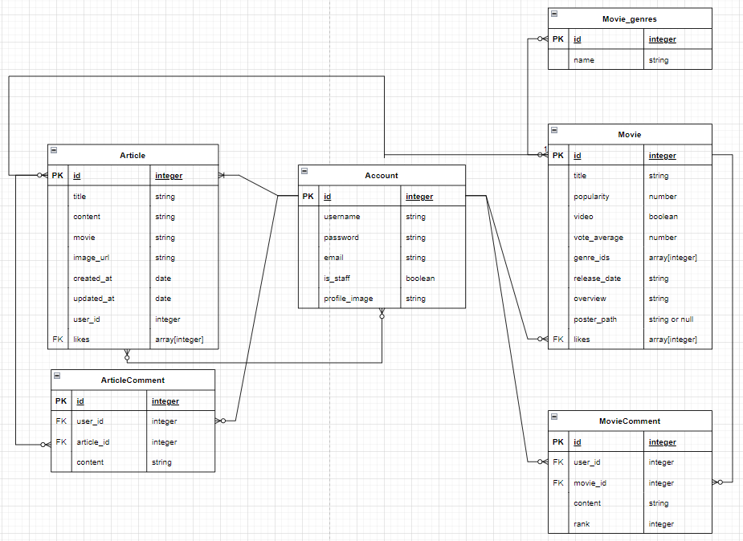
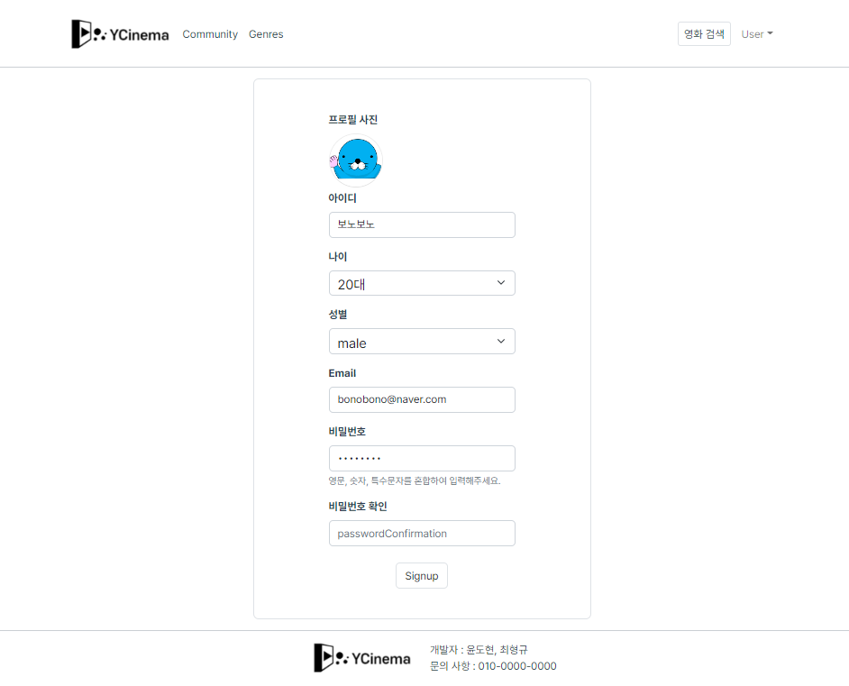
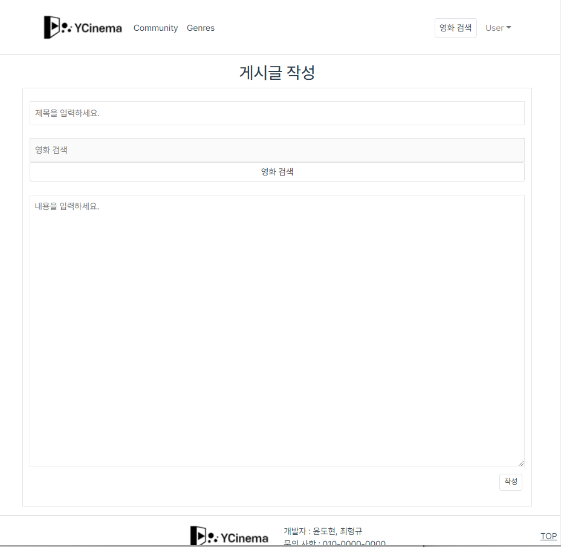
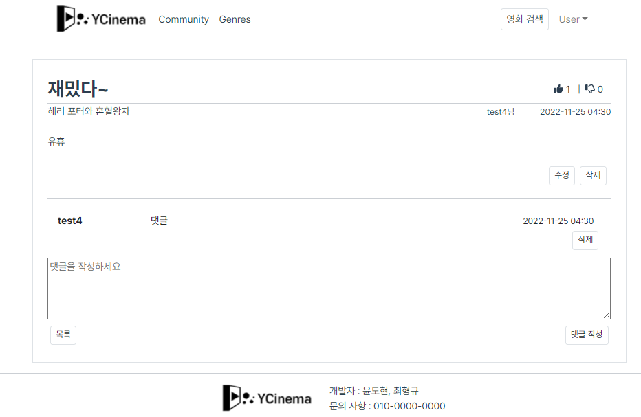
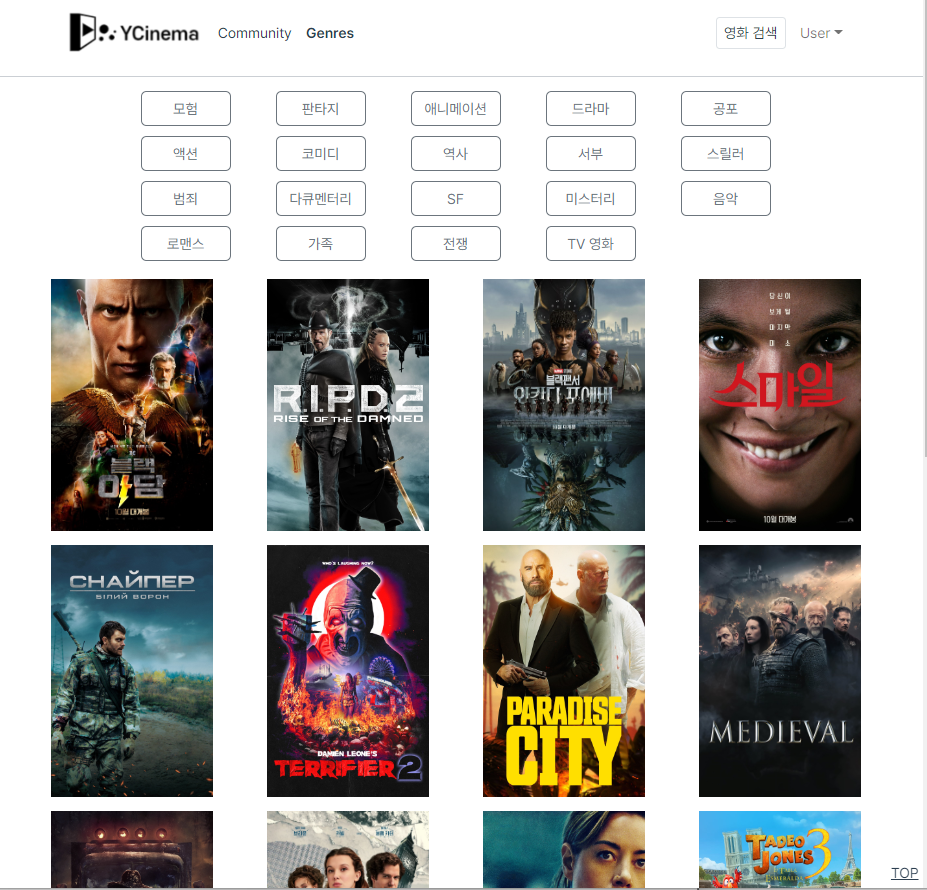
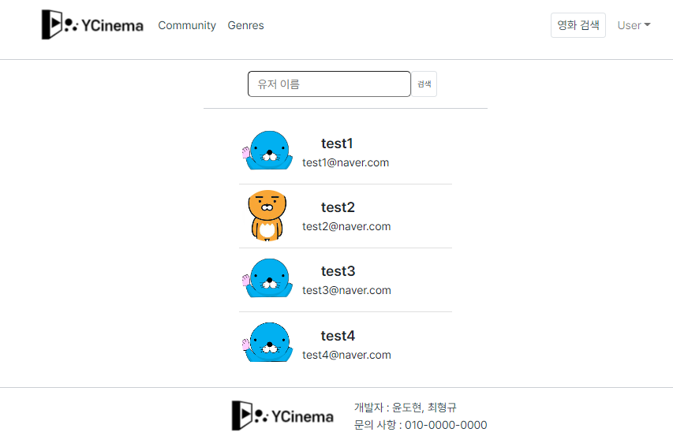
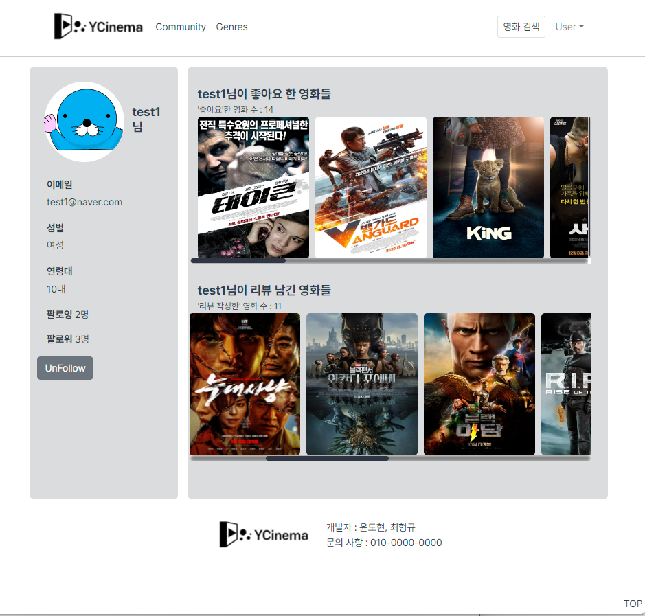
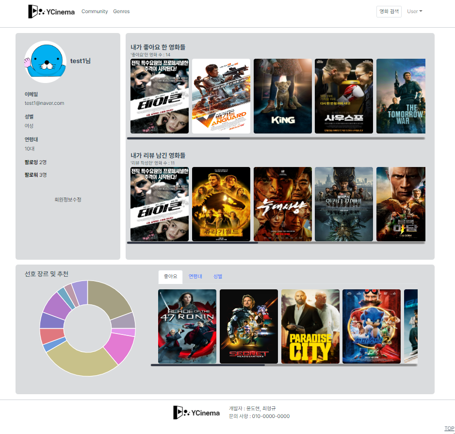
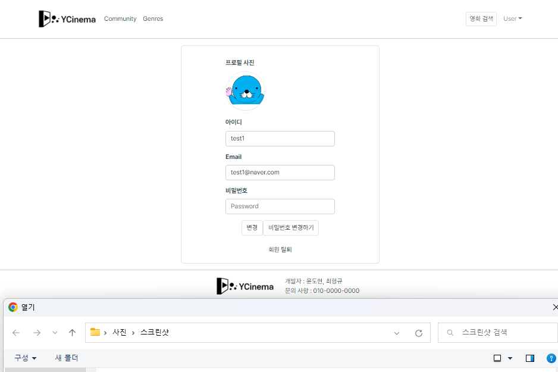
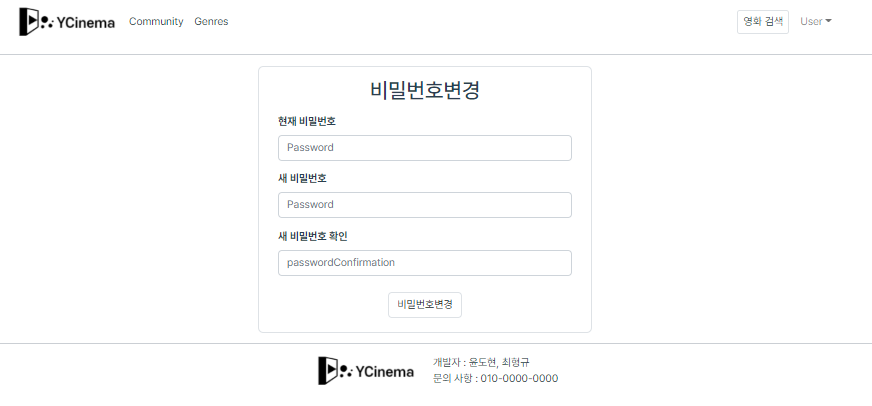

# FINAL PJT. 영화 추천 알고리즘 기반 커뮤니티 서비스


## ✨ 팀 구성

#### 윤도현 (팀장)

- 


#### 최형규 (팀원)

- User
  - JWT를 통한 로그인, 회원가입, 회원정보수정, 회원탈퇴 기능 구현
  - 유저 프로필, 마이페이지, 유저 팔로우 기능 구현
  - 프로필 사진 기능 구현
  - 유저 검색 기능 구
- Community 
  - 게시글 생성, 수정, 삭제, 목록 기능 구현
  - 게시글 댓글 기능 구현
- 전체적인 CSS 적용
  - flex, grid 사용
- 알고리즘
  - 각 유저별 영화 좋아요에 따른 추천 알고리즘 구현


## ✨ 초기 프로젝트 목표

1. 영화 조회 서비스
   - index : 현재 상영작 인기순
   - 영화 검색 서비스
   - 장르별 영화 조회
   - 영화 상세 조회
     - Youtube trailer 영상 제공
     - 관련 기사 크롤링해서 보여주기
     - 댓글, 좋아요 기능
2. 마이 페이지
   - 유저 프로필 - 프사, 소개 등
   - 로그인 기능 구현 (JWT(Json Web Token) 사용)
     - 회원가입 시 좋아하는 장르 선택 → 알고리즘 짤 때 가중치로 반영
     - 개인정보 변경 기능
   - 좋아요 눌린 영화 모아보기
3. 영화 추천 알고리즘
   - 영화 상세 조회를 눌린 횟수 기반 상위권 장르들의 영화 - 가중치 : 4
   - 회원가입시 선택한 장르 - 가중치 : 3
   - 좋아요 눌린 영화 장르 - 가중치 : 3
4. 커뮤니티 게시판
   - 영화 추천 게시판
   - 배우 추천 게시판
   - 영화 월드컵


## ✨ 실제 구현 정도

1. **영화 조회 서비스**
   - **index : 현재 상영작 인기순**
   - **영화 검색 서비스**
   - **장르별 영화 조회**
   - **영화 상세 조회**
     - **Youtube trailer 영상 제공**
     - ~~관련 기사 크롤링해서 보여주기~~
     - **댓글, 좋아요 기능**
2. **마이 페이지**
   - **유저 프로필 - 프사, 소개 등**
   - **+유저 검색 기능, 유저 팔로우 기능**
   - **로그인 기능 구현 (JWT(Json Web Token) 사용)**
     - ~~회원가입 시 좋아하는 장르 선택 → 알고리즘 짤 때 가중치로 반영~~
     - **개인정보 변경 기능**
   - **좋아요 눌린 영화 모아보기**
   - **+리뷰 쓴 영화 모아보기**
3. **영화 추천 알고리즘**
   - ~~영화 상세 조회를 눌린 횟수 기반 상위권 장르들의 영화 - 가중치 : 4~~
   - ~~회원가입시 선택한 장르 - 가중치 : 3~~
   - ~~좋아요 눌린 영화 장르 - 가중치 : 3~~
   - **+해당 유저가 좋아요 영화들의 장르를 종합 후 상위 3개 항목에 대해 그 비율에 따른 가중치를 설정하여 해당 장르들에 속한다면 점수를 합산하는 방식 채택**
4. **커뮤니티 게시판**
   - **영화 추천 게시판**
   - ~~배우 추천 게시판~~
   - ~~영화 월드컵~~


## ✨ 데이터베이스 모델링(ERD)




## ✨ 사용 기술

- HTML, CSS, Python, Django, Vue.js


## 🗓️ 프로젝트 기간

- 22.11.16 ~ 22.11.25


## ✨프로젝트 진행 과정

#### 1. 준비 단계

**목표 서비스 설정**

- 페이지 초안, 필요한 기능, 홈페이지 구성 방식, 데이터베이스 모델링 등에 관해 회의


**DB 만들기**

- TMDB 사이트의 API Key를 통해 약 1000개의 데이터를 받아 fixtures 폴더에 json 파일로 저장

```python
# get_data.py
import urllib.request
from pprint import pprint
import json

API_KEY = "your api key"
HOST = "https://api.themoviedb.org"
MOVIE_LIST_URI = "/3/movie/popular"
MOVIE_INFO_URI = "/3/movie/"
GENRE_LIST_URI = "/3/genre/movie/list"

movie_list = []
movie_Ids = []
genre_list = []
genre_request = (f'{HOST}{GENRE_LIST_URI}?api_key={API_KEY}&language=ko')
response = urllib.request.urlopen(genre_request)
json_str = response.read().decode('utf-8')
json_object = json.loads(json_str)
genre_data = json_object.get("genres")
for data in genre_data:
    my_data = {
        "number": data.get("id"),
        "name": data.get("name")
    }
    my_genre = {
        "model": "movies.genre",
        "pk": my_data.get("number"),
        "fields": {
            "name": my_data.get("name")
        },
    }
    genre_list.append(my_genre)
for i in range(1, 50):
    request = (f'{HOST}{MOVIE_LIST_URI}?api_key={API_KEY}&language=ko&page={i}')
    response = urllib.request.urlopen(request)
    json_str = response.read().decode('utf-8')
    json_object = json.loads(json_str)
    data_movies = (json_object.get("results"))
    for movie in data_movies:
        movie_Ids.append(movie.get("id"))
for idx, movie_Id in enumerate(movie_Ids):
    movie_request = (f'{HOST}{MOVIE_INFO_URI}{movie_Id}?api_key={API_KEY}&language=ko&')
    response = urllib.request.urlopen(movie_request)
    json_str = response.read().decode('utf-8')
    json_object = json.loads(json_str)
    if json_object.get("poster_path"):
        if json_object.get("genres"):
            genre_orginal_data = json_object.get("genres")
            genre_id_list = []
            for i in genre_orginal_data:
                genre_id_list.append(i['id'])
            my_object = {
                "model": "movies.movie",
                "pk": idx+1,
                "fields": {
                    "title": json_object.get("title"),
                    "adult": json_object.get("adult"),
                    "popularity": json_object.get("popularity"),
                    "poster_path": json_object.get("poster_path"),
                    "release_date": json_object.get("release_date"),
                    "runtime": json_object.get("runtime"),
                    "vote_average": json_object.get("vote_average"),
                    "vote_count": json_object.get("vote_count"),
                    "overview": json_object.get("overview"),
                    "genres": genre_id_list,#json_object.get("genres"),
                    "original_title": json_object.get("original_title"),
                    "original_id": json_object.get("id"),
                }  
            }
        else:
            genre_orginal_data = json_object.get("genres")
            genre_id_list = []
            for i in genre_orginal_data:
                genre_id_list.append(i['id'])
            my_object = {
                "model": "movies.movie",
                "pk": idx+1,
                "fields": {
                    "title": json_object.get("title"),
                    "adult": json_object.get("adult"),
                    "popularity": json_object.get("popularity"),
                    "poster_path": json_object.get("poster_path"),
                    "release_date": json_object.get("release_date"),
                    "runtime": json_object.get("runtime"),
                    "vote_average": json_object.get("vote_average"),
                    "vote_count": json_object.get("vote_count"),
                    "overview": json_object.get("overview"),
                    "genres": genre_id_list,#json_object.get("genres"),
                    "original_title": json_object.get("original_title"),
                    "original_id": json_object.get("id")
                }
            }
        movie_list.append(my_object)
with open('movies.json', 'w', encoding='UTF-8') as file:
    file.write(json.dumps(movie_list, ensure_ascii=False))
with open('genres.json', 'w', encoding='UTF-8') as file:
    file.write(json.dumps(genre_list, ensure_ascii=False))
```


#### 2. 백엔드 작업

**필요한 app 구성**

- movies : 영화 데이터를 다룰 앱
- accounts : 유저 데이터를 다룰 앱
- articles : 커뮤니티 게시글을 다룰 앱


#### DRF를 통한 데이터 전송

- Django에서 전송 받은 데이터를 바탕으로 serializer를 이용해 데이터베이스에 정보를 저장


#### 3. 프론트엔드 작업

**라우터 설정**


**컴포넌트 구성**

- movies 관련 : 영화 정보를 다룰 페이지들

- accounts 관련 : 유저 정보 및 로그인을 다룰 페이지들
- articles 관련 : 커뮤니티 게시글을 다룰 페이지들


#### 4. 자바스크립트를 이용한 각종 이벤트 처리

**비동기 처리**


#### 5. 영화 추천 알고리즘 구현

**좋아요 기반**

- 해당 유저가 좋아요를 눌린 영화들의 장르들 중 상위 3개의 장르를 선정
- 선정된 3개의 장르의 비율을 가중치로 선정
- Sigma(영화의 인기도(popularity) * 해당 장르의 가중치)를 통해 데이터를 뽑아냄
- 뽑아낸 데이터 중 점수가 상위 40개의 영화 데이터 중 랜덤으로 추천


**연령대 기반**

- 해당 유저의 연령대별 장르에 대한 좋아요 수 중 상위 3개의 장르를 선정
- 선정된 3개의 장르의 비율을 가중치로 선정
- Sigma(영화의 인기도(popularity) * 해당 장르의 가중치)를 통해 데이터를 뽑아냄
- 뽑아낸 데이터 중 점수가 상위 40개의 영화 데이터 중 랜덤으로 추천


**성별 기반**

- 해당 유저의 성별 장르에 대한 좋아요 수 중 상위 3개의 장르를 선정
- 선정된 3개의 장르의 비율을 가중치로 선정
- Sigma(영화의 인기도(popularity) * 해당 장르의 가중치)를 통해 데이터를 뽑아냄
- 뽑아낸 데이터 중 점수가 상위 40개의 영화 데이터 중 랜덤으로 추천


#### 6. CSS 적용


## 🔓 기능 설명

#### 1. 로그인

- 로그인과 로그아웃은 JWT를 통한 토큰 기반의 로그인 구현 방식을 채택


#### 2. 회원 가입

- 회원가입 시 ID 중복, Email 중복은 불가하며 비밀번호 설정 시 8~16자, 숫자 포함, 특수문자 포함 이라는 조건이 있음




#### 3. 메인 화면

- Navbar를 통한 페이지 이동이 가능. 단, Community 페이지는 로그인을 해야 이용 가능하고, 로그인 하지 않고 누른다면 경고창이 뜬다.
- 메인 화면의 핵심은 3D carousel을 통한 랜덤 영화 출력임. 해당 영화에 마우스를 호버한다면 평점과 Detail 페이지로 갈 수 있는 버튼이 생기도록 구현
- 3D carousel 밑으로 인기순, 평점순 영화 데이터들이 나오고 가장 밑에는 오늘의 장르를 랜덤으로 선정해 해당 장르의 영화를 랜덤으로 출력하도록 구현


#### 4. 영화 검색

- 오른쪽 상단 Navbar에 영화 검색 기능 구현
- 모달창을 띄어 입력창에 검색어를 입력 할 경우 실시간으로 해당 문자열과 매칭되는 영화를 출력
- 해당 영화를 클릭하면 영화 Detail 페이지로 이동


#### 5. 영화 상세 페이지

- 오른쪽 상단에 하트를 클릭하면 ''좋아요'' 상태가 되고 카운트 증가
- 예고편 버튼 클릭시 모달창이 뜨면서  해당 영화의 Trailer 영상 재생
- 별점을 선택하고 댓글을 달 경우 댓글 리뷰 생성 가능
- 관련 장르의 영화들 랜덤 출력


#### 6. 커뮤니티 게시판

- 로그인 한 사람만 이용 가능
- 한 페이지 당 게시글 5개로 페이지네이션 구현
- 게시글 제목 혹은 글쓴이 검색 가능
- 해당 영화 이름을 클릭할 경우 Detail 페이지로 이


#### 7. 게시글 생성하기

- 영화 검색 버튼을 클릭하면 영화를 검색할 수 있는 모달창 생성
- 검색 후 클릭하면 해당 영화 정보가 데이터에 담기고, 게시글 생성 시 Django로 전달되어 데이터베이스에 저장됨




#### 8. 게시글 디테일

- 댓글 기능, 좋아요, 싫어요 기능




#### 9. 전체 영화 페이지

- 장르 버튼을 클릭하면 해당 장르에 해당하는 영화만 필터링해서 보여줌




#### 10. 유저 검색 페이지

- 찾고 싶은 유저 검색 가능
- 해당 유저 클릭 시 해당 유저의 프로필 페이지로 이동




#### 11. 유저 프로필 페이지

- 해당 유저가 "좋아요" 눌린 영화들, 리뷰 댓글을 단 영화들 출력
- 해당 유저의 정보 출력
- 팔로우 버튼 구현




#### 12. 마이 페이지

- 유저 프로필 페이지에서 회원정보수정 버튼, 선호 장르 및 추천 영화 항목 추가
- vuechart.js를 통해 장르별 좋아요 수를 도넛 차트로 표현
- 추천 알고리즘 컨셉인 좋아요, 연령대, 성별 버튼들을 누르면 해당 컨셉의 추천 영화들 출력




#### 13. 유저 정보 수정

- 프로필 사진 클릭 시 프로필 사진 변경 가능
- 비밀번호 불일치 시 수정 불가
- 회원탈퇴 클릭 시 비밀번호를 한번 더 입력하라는 모달창이 뜸
  - 비밀번호 일치 시 회원 탈퇴 진행






## ✨ 프로젝트 후기

#### 윤도현


#### 최형규

평소 편한 방식으로만 하는 습관 때문에 코드가 많아질수록 힘들어졌다. 특히 CSS를 적용하려고 할 때 이전에 썼던 style들이 다 인라인이라 한꺼번에 수정하기 거의 불가능에 가까웠고, 그러다보니 처음에 구현하고 싶었던 다크모드를 구현할 시도를 못했다. 추후에 시간이 여유로울 때 한번 해봐야겠다..

처음으로 명세 없이 스스로의 힘으로 프로젝트를 진행해 봤는데 명세를 보고 할 때와는 차원이 달랐다. 잘 짜여진 계획과 구상은 프로젝트의 효율성과 직결된다는 것을 뼈저리게 느꼈다. 특히 vue에서 컴포넌트 구성 없이 한 파일에서 다 만들려고 하다보니 CSS 배치도 꼬이고 코드를 찾기가 어려워 체력 소모도 더 컸다. 물론 우리 팀이 처음에 회의를 안하고 프로젝트를 진행한 것은 아니지만, 처음 기획 단계에서 전체적인 틀을 잡는 것 뿐만 아니라 세부적인 부분 중 중요한 부분이 무엇인지를 꼼꼼히 생각해봐야 한다는 것을 느꼈다. 

Django와 Vue를 배웠지만 프로젝트 초기에는 내 손으로 짠 코드가 거의 없다시피 구글링을 통해 긇어 모아 구현을 할 정도로 막막했다. 하지만 하루 8시간, 많게는 14시간동안 코드를 짜다 보니 점점 Django와 Vue의 동작 원리를 이해하게 되었고, 프로젝트 막바지에는 거의 내 손으로 필요한 기능들을 구현한 것 같다. 실력이 늘면서 드는 생각이 프로젝트 초반에 짠 코드들이 너무 아쉽다는 생각이 들었다. 조금 더 효율적으로 혹은 알아보기 쉽게 짰으면 유지보수가 쉽게 될텐데라는 생각이 가장 많이 들었고, 앞으로는 무작정 코드를 긁어오는 것이 아니라 이해를 하고 가져올 수 있도록 노력해야겠다.

추가로 아쉬운 점은 프로젝트 기간 동안 시간 관리에 실패했다는 것이다. 전체적인 구현을 완성하기도 전에 디테일 적인 부분부터 신경 쓰느라 목표로 했던 기능들을 다 구현하지 못한게 가장 아쉽다. 이 부분도 기획 단계에서 프로젝트 일정을 조금 더 신경써서 짰더라면 어땟을까 라는 생각이 든다.. 기획이 가장 중요하다는 것을 크게 깨달은 프로젝트였다!